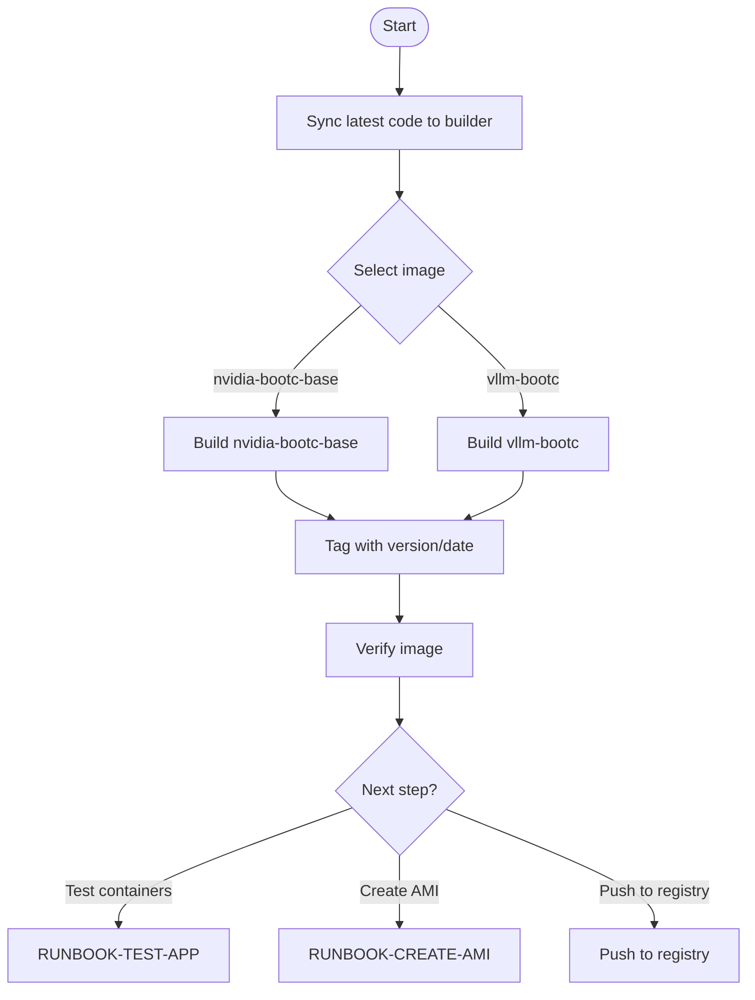
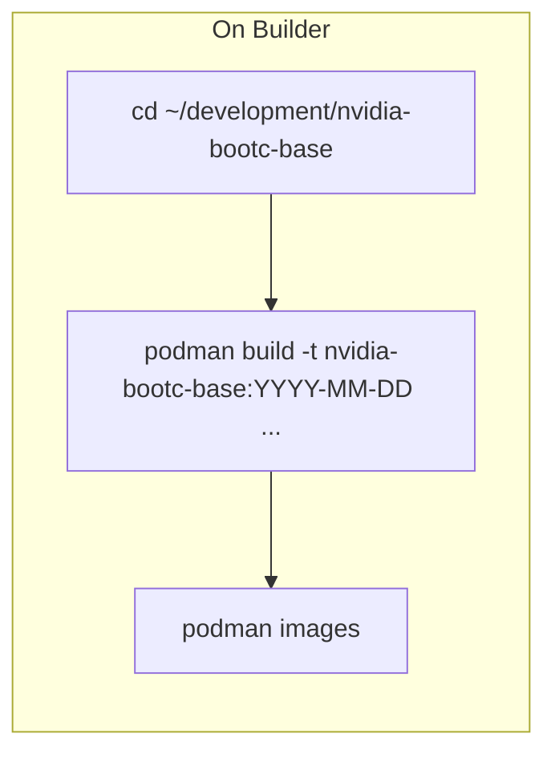

# RUNBOOK-BUILD-IMAGE: Production Image Build

**Purpose:** Build final production container images (nvidia-bootc-base, vllm-bootc) on the builder machine.

## Prerequisites

- Builder machine running (see [RUNBOOK-INFRA](RUNBOOK-INFRA.md))
- Development iteration complete, image tested (see [RUNBOOK-DEVELOPMENT](RUNBOOK-DEVELOPMENT.md))
- Latest code synced to builder

## Overview Diagram



## Available Images

| Image | Directory | Containerfile | Description |
|-------|-----------|---------------|-------------|
| nvidia-bootc-base | `nvidia-bootc-base/` | `Containerfile` | RHEL 9 bootc with NVIDIA drivers |
| vllm-bootc | `vllm-bootc/` | `Containerfile` | vLLM from source on bootc |

## Procedure

### 1. Sync Latest Code

From **local machine**:

```bash
# Sync the image directory you're building
rsync -avz nvidia-bootc-base/ ec2-user@<BUILDER_IP>:~/development/nvidia-bootc-base/
```

### 2. Build Production Image

Start a local tmux session and SSH to builder:

```bash
# Create or attach to local tmux session
tmux new -s builder || tmux attach -t builder

# SSH to builder (from within tmux)
cd infra/builder && tofu output ssh_command
ssh -i ~/.ssh/<key>.pem ec2-user@<BUILDER_IP>
```

Build with production tag:



#### nvidia-bootc-base

```bash
cd ~/development/nvidia-bootc-base
podman build -t nvidia-bootc-base:$(date +%Y-%m-%d) -f Containerfile .
```

#### vllm-bootc

```bash
cd ~/development/vllm-bootc
podman build -t vllm-bootc:$(date +%Y-%m-%d) -f Containerfile .
```

### 3. Verify Image

```bash
# List images
podman images | grep -E "(nvidia-bootc-base|vllm-bootc)"

# Check image size
podman images --format "{{.Repository}}:{{.Tag}} {{.Size}}" | grep -E "(nvidia-bootc-base|vllm-bootc)"

# Inspect image labels
podman inspect nvidia-bootc-base:$(date +%Y-%m-%d) --format '{{.Config.Labels}}'
```

### 4. Optional: Push to Registry

If pushing to a container registry:

```bash
# Tag for registry
podman tag nvidia-bootc-base:$(date +%Y-%m-%d) quay.io/<org>/nvidia-bootc-base:$(date +%Y-%m-%d)

# Push
podman push quay.io/<org>/nvidia-bootc-base:$(date +%Y-%m-%d)
```

## Tagging Conventions

| Format | Example | Use Case |
|--------|---------|----------|
| Date-based | `2026-01-16` | Standard builds |
| Semantic version | `v1.0.0` | Releases |
| `latest` | `latest` | Current stable |

## Build Options Reference

```bash
podman build \
  -t <image-name>:<tag> \       # Name and tag
  -f <Containerfile> \          # Containerfile to use
  --no-cache \                  # Force full rebuild (optional)
  --squash \                    # Squash layers (DO NOT use for bootc)
  .                             # Build context
```

**Important:** Do NOT use `--squash` for bootc images. Bootc requires hardlinks preserved by ostree.

## Decision Points

### Which Image to Build?

| Scenario | Image | Reason |
|----------|-------|--------|
| GPU-enabled bootc base | `nvidia-bootc-base` | NVIDIA drivers pre-installed |
| Need vLLM from source | `vllm-bootc` | Custom vLLM build on bootc |

### What to Do After Build?

| Goal | Next Runbook |
|------|--------------|
| Test on standard RHEL host | [RUNBOOK-TEST-APP](RUNBOOK-TEST-APP.md) |
| Create bootable AMI | [RUNBOOK-CREATE-AMI](RUNBOOK-CREATE-AMI.md) |
| Store in registry for later | Push to quay.io/registry.redhat.io |

## Verification

Build is successful when:

1. Exit code is 0
2. Image appears in `podman images`
3. Image has expected size (typically 2-5 GB for bootc images)
4. Labels are present (if configured in Containerfile)

```bash
# Full verification
podman images | grep nvidia-bootc-base
# Expected: Shows image with correct tag and reasonable size
```

## Troubleshooting

### Build Fails: Network Issues

```bash
# Check DNS resolution
nslookup registry.redhat.io

# Check registry connectivity
curl -I https://registry.redhat.io/v2/
```

### Build Fails: Authentication Required

```bash
# Re-login to Red Hat registry
podman login registry.redhat.io

# Verify auth file exists
cat ~/.docker/config.json
# or
cat ${XDG_RUNTIME_DIR}/containers/auth.json
```

### Build Takes Too Long

```bash
# Check available resources
free -h
df -h

# Clean up to free space
podman system prune

# Consider stopping other containers
podman ps
podman stop <container-id>
```

### Image Size Unexpectedly Large

```bash
# Analyze layers
podman history nvidia-bootc-base:$(date +%Y-%m-%d)

# Look for large layers that could be optimized
```
