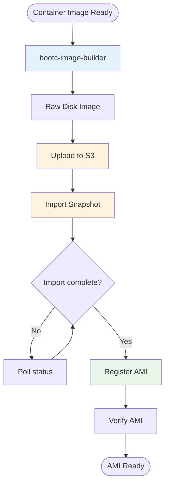
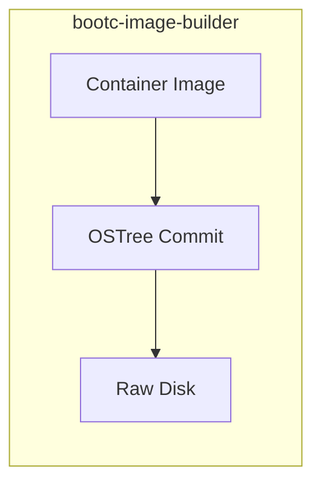
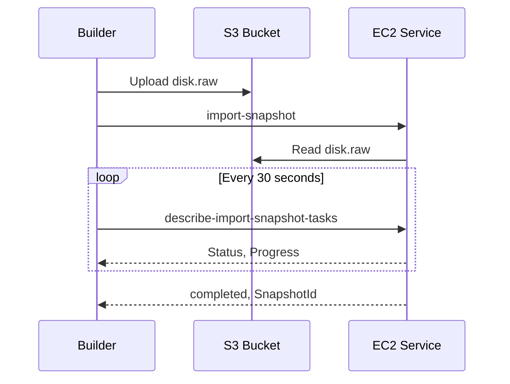

# RUNBOOK-CREATE-AMI: Create Bootable AMI

**Purpose:** Convert a container image to a bootable AWS AMI using bootc-image-builder, S3, and EC2 import.

## Prerequisites

- Container image built on builder (see [RUNBOOK-BUILD-IMAGE](RUNBOOK-BUILD-IMAGE.md))
- Builder has IAM role with S3 and EC2 import permissions
- S3 bucket available for image upload

## Overview Diagram



## Procedure

### 1. Start Local tmux Session and SSH to Builder

**Always use a local tmux session when working on remote machines.** AMI creation involves long-running operations where connection loss could be costly.

```bash
# Create or attach to local tmux session for builder
tmux new -s builder || tmux attach -t builder

# SSH to builder (from within tmux)
cd infra/builder && tofu output ssh_command
ssh -i ~/.ssh/<key>.pem ec2-user@<BUILDER_IP>
```

**If disconnected:** Reattach locally with `tmux attach -t builder`.

### 2. Create Output Directory

On builder:

```bash
mkdir -p ~/development/images
```

### 3. Convert to Raw Disk with bootc-image-builder

```bash
sudo podman run --rm --privileged \
  -v /var/lib/containers/storage:/var/lib/containers/storage \
  -v ~/development/images:/output \
  quay.io/centos-bootc/bootc-image-builder:latest \
  --type raw \
  localhost/nvidia-bootc-base:$(date +%Y-%m-%d)
```

**Expected output:** Raw disk at `~/development/images/raw/disk.raw`



### 4. Verify Raw Disk

```bash
ls -lh ~/development/images/raw/
```

**Expected:** `disk.raw` file (typically 2-10 GB)

### 5. Create/Verify S3 Bucket

```bash
# Check if bucket exists or create it
aws s3 ls s3://rhoim-images 2>/dev/null || \
  aws s3 mb s3://rhoim-images --region us-east-1
```

### 6. Upload Raw Disk to S3

```bash
aws s3 cp ~/development/images/raw/disk.raw \
  s3://rhoim-images/nvidia-bootc-base/disk-$(date +%Y-%m-%d).raw \
  --region us-east-1
```

**Note:** This may take several minutes depending on file size and network speed.

Monitor progress:
```bash
# S3 upload shows progress automatically
# For large files, consider using --expected-size
```

### 7. Import Snapshot

```bash
aws ec2 import-snapshot \
  --region us-east-1 \
  --description "nvidia-bootc-base $(date +%Y-%m-%d)" \
  --disk-container "Format=raw,Url=s3://rhoim-images/nvidia-bootc-base/disk-$(date +%Y-%m-%d).raw"
```

**Save the `ImportTaskId` from output** - you'll need it to monitor progress.

Example output:
```json
{
    "ImportTaskId": "import-snap-0123456789abcdef0",
    ...
}
```

### 8. Monitor Import Progress

```bash
aws ec2 describe-import-snapshot-tasks \
  --region us-east-1 \
  --import-task-ids <IMPORT_TASK_ID>
```

**Poll until `Status` is `completed`:**

```bash
# Watch import progress (run periodically)
watch -n 30 "aws ec2 describe-import-snapshot-tasks \
  --region us-east-1 \
  --import-task-ids <IMPORT_TASK_ID> \
  --query 'ImportSnapshotTasks[0].SnapshotTaskDetail.{Status:Status,Progress:Progress}'"
```

**When complete, note the `SnapshotId`** from the output.



### 9. Register AMI from Snapshot

```bash
aws ec2 register-image \
  --region us-east-1 \
  --name "nvidia-bootc-base-$(date +%Y-%m-%d)" \
  --description "RHOIM NVIDIA Bootc Base Image" \
  --architecture x86_64 \
  --root-device-name /dev/xvda \
  --block-device-mappings "DeviceName=/dev/xvda,Ebs={SnapshotId=<SNAPSHOT_ID>,VolumeType=gp3}" \
  --virtualization-type hvm \
  --ena-support
```

**Save the `ImageId` (AMI ID) from output.**

### 10. Verify AMI

```bash
aws ec2 describe-images \
  --region us-east-1 \
  --image-ids <AMI_ID> \
  --query 'Images[0].{State:State,Name:Name}'
```

**Expected:** `State` is `available`

### 11. Update bootc-tester Configuration

If you want to test this AMI with bootc-tester:

```bash
# Local machine
cd infra/bootc-tester

# Edit main.tf to use new AMI ID
# Update the ami variable or data source
```

See [RUNBOOK-TEST-BOOTC](RUNBOOK-TEST-BOOTC.md) for testing.

## Quick Reference

| Step | Command | Output |
|------|---------|--------|
| Convert to raw | `sudo podman run ... bootc-image-builder --type raw` | `~/development/images/raw/disk.raw` |
| Upload to S3 | `aws s3 cp disk.raw s3://...` | S3 object |
| Import snapshot | `aws ec2 import-snapshot ...` | ImportTaskId |
| Check progress | `aws ec2 describe-import-snapshot-tasks ...` | Status, SnapshotId |
| Register AMI | `aws ec2 register-image ...` | ImageId (ami-xxx) |

## Decision Points

### Which Output Format?

| Format | Use Case |
|--------|----------|
| `raw` | AWS AMI import (this runbook) |
| `qcow2` | Local testing, OpenStack |
| `iso` | Bare metal installation |

### Naming Convention for AMI

| Format | Example | Use |
|--------|---------|-----|
| Date-based | `nvidia-bootc-base-2026-01-16` | Standard builds |
| Version-based | `nvidia-bootc-base-v1.0.0` | Releases |

## Verification

AMI creation is successful when:

1. Snapshot import shows `Status: completed`
2. AMI shows `State: available`
3. AMI has correct name and description
4. AMI can launch an EC2 instance

```bash
# Full verification
aws ec2 describe-images --image-ids <AMI_ID> \
  --query 'Images[0].{State:State,Name:Name,RootDeviceName:RootDeviceName}'
```

## Troubleshooting

### Import Snapshot Fails: Access Denied

Verify builder IAM role has required permissions:
```bash
# Check instance profile
curl http://169.254.169.254/latest/meta-data/iam/security-credentials/
```

Required permissions:
- `s3:GetObject` on the bucket
- `ec2:ImportSnapshot`
- `ec2:DescribeImportSnapshotTasks`

### Import Fails: Invalid Format

Ensure the disk is raw format:
```bash
file ~/development/images/raw/disk.raw
# Should show: "DOS/MBR boot sector" or similar
```

### Upload Slow

For large files, consider:
```bash
# Use multipart upload threshold
aws configure set s3.multipart_threshold 64MB
```

### AMI Won't Boot

Check:
1. Root device name matches (`/dev/xvda`)
2. Virtualization type is `hvm`
3. ENA support enabled
4. Architecture matches build (`x86_64`)

### Cleanup Old AMIs

```bash
# List your AMIs
aws ec2 describe-images --owners self \
  --query 'Images[*].[ImageId,Name,CreationDate]' --output table

# Deregister old AMI
aws ec2 deregister-image --image-id <OLD_AMI_ID>

# Delete associated snapshot
aws ec2 delete-snapshot --snapshot-id <SNAPSHOT_ID>
```
