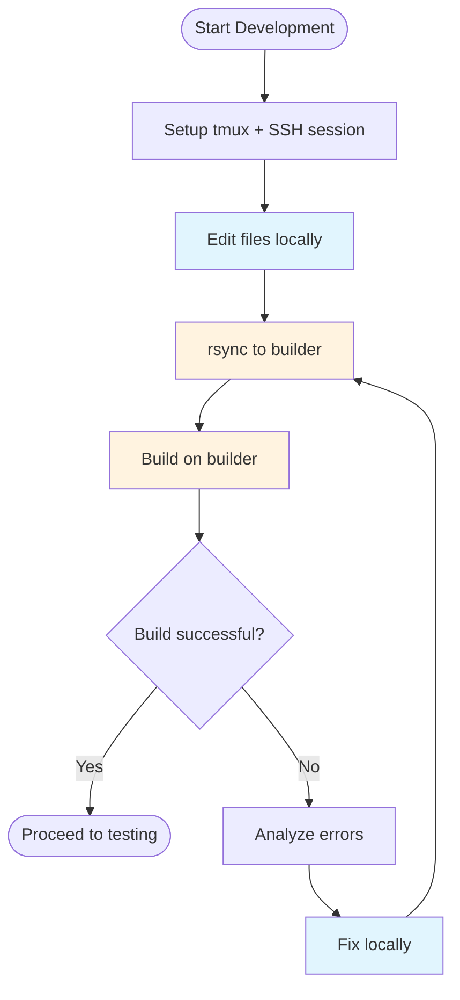
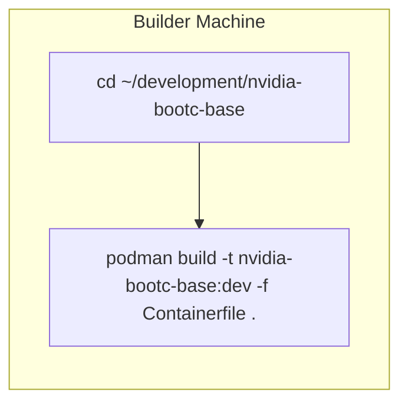
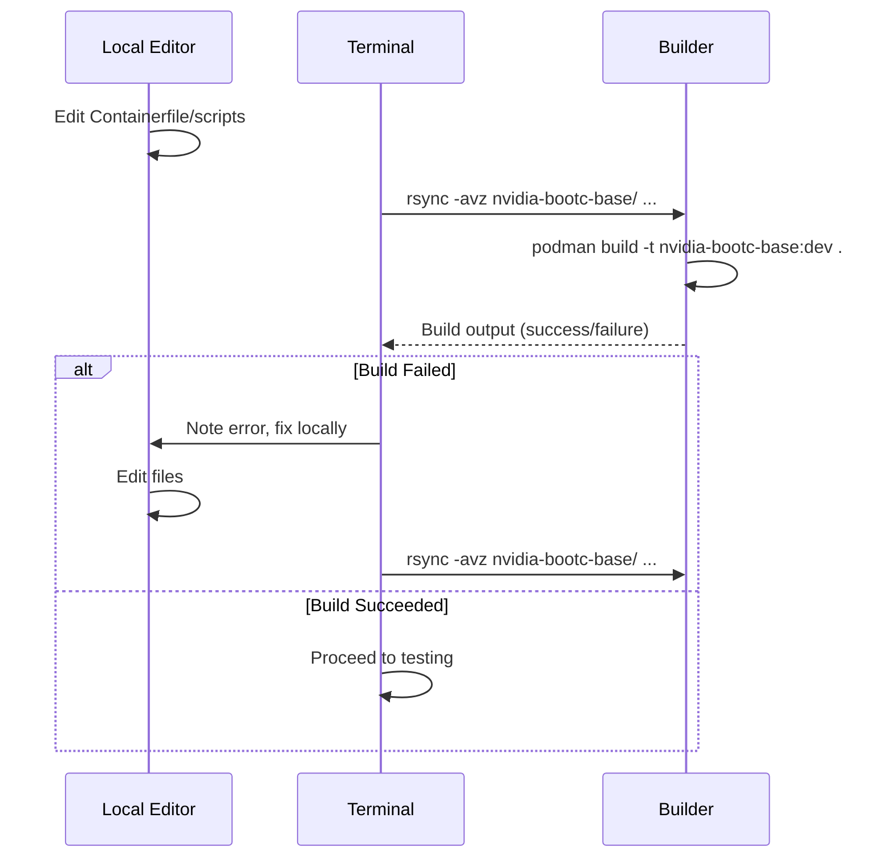

# RUNBOOK-DEVELOPMENT: Development Iteration

**Purpose:** Iterative development workflow - edit locally, sync to builder, build, review errors, fix locally, repeat.

## Prerequisites

- Builder machine running (see [RUNBOOK-INFRA](RUNBOOK-INFRA.md))
- SSH access configured
- Local project directory ready with changes

## Overview Diagram



## Procedure

### 1. Setup Session

#### Start Local tmux Session

**Always use a local tmux session when working on remote machines.** This protects against network disconnects and allows resuming work.

```bash
# Create or attach to local tmux session for builder
tmux new -s builder || tmux attach -t builder
```

#### SSH to Builder (From Within tmux)

```bash
# Get SSH command from infra
cd infra/builder
tofu output ssh_command

# Connect (example) - run this from inside the tmux session
ssh -i ~/.ssh/<key>.pem ec2-user@<BUILDER_IP>
```

**If disconnected:** Your SSH session is preserved. Reattach locally with `tmux attach -t builder`.

#### Create Development Directory (Builder, First Time Only)

```bash
mkdir -p ~/development
```

### 2. Sync Code to Builder

From your **local machine** (separate terminal or tmux window, not inside the SSH session):

```bash
# Sync nvidia-bootc-base directory
rsync -avz nvidia-bootc-base/ ec2-user@<BUILDER_IP>:~/development/nvidia-bootc-base/

# Sync vllm-bootc directory
rsync -avz vllm-bootc/ ec2-user@<BUILDER_IP>:~/development/vllm-bootc/
```

**Flags explained:**
- `-a` Archive mode (preserves permissions, timestamps)
- `-v` Verbose (shows files transferred)
- `-z` Compress during transfer

### 3. Build on Builder

In your **tmux SSH session** to builder:

```bash
# Navigate to synced directory
cd ~/development/nvidia-bootc-base

# Build the image
podman build -t nvidia-bootc-base:dev -f Containerfile .
```



### 4. Review Build Output

Watch the build output for:
- **Errors:** Build failures, missing dependencies
- **Warnings:** Deprecation notices, potential issues
- **Layer caching:** Which steps are cached vs rebuilt

### 5. Fix Errors Locally

If build fails:

1. Note the error message and failing step
2. Switch to local editor
3. Fix the issue in the local files
4. Return to step 2 (sync and rebuild)

### 6. Iteration Loop



## Commands Reference

### Sync Commands

| Image | Command |
|-------|---------|
| nvidia-bootc-base | `rsync -avz nvidia-bootc-base/ ec2-user@<IP>:~/development/nvidia-bootc-base/` |
| vllm-bootc | `rsync -avz vllm-bootc/ ec2-user@<IP>:~/development/vllm-bootc/` |

### Build Commands

| Image | Containerfile | Command |
|-------|---------------|---------|
| nvidia-bootc-base | Containerfile | `podman build -t nvidia-bootc-base:dev -f Containerfile .` |
| vllm-bootc | Containerfile | `podman build -t vllm-bootc:dev -f Containerfile .` |

## Decision Points

### When to Clear Build Cache?

```bash
# If you need a completely fresh build
podman system prune -a

# Remove specific image to force rebuild
podman rmi nvidia-bootc-base:dev
```

## Verification

Build is successful when:
- Exit code is 0
- Final output shows: `Successfully tagged localhost/nvidia-bootc-base:dev`
- Image appears in: `podman images | grep nvidia-bootc-base`

## Troubleshooting

### rsync: Connection Refused

Builder may have new IP after stop/start:
```bash
cd infra/builder
tofu refresh
tofu output ssh_command
```

### Build Fails: Subscription Required

For RHEL packages requiring subscription:
```bash
# On builder, check subscription status
sudo subscription-manager status

# Check available repos
sudo dnf repolist
```

### Build Fails: Out of Disk Space

```bash
# Check disk usage
df -h

# Clean up old images and build cache
podman system prune -a
```

### Build Slow: No Layer Caching

Ensure you're building from the same directory:
```bash
# Always build from ~/development/<image>/
cd ~/development/nvidia-bootc-base
podman build -t nvidia-bootc-base:dev -f Containerfile .
```

## Workflow for Claude

When user requests "sync and build":

1. Determine which image directory to sync
2. Execute rsync command from local to builder
3. Provide build command to run on builder
4. If build fails, analyze errors and propose fixes
5. After fixing, sync and rebuild
6. Track iteration count to prevent infinite loops (max 5 iterations before asking user)
