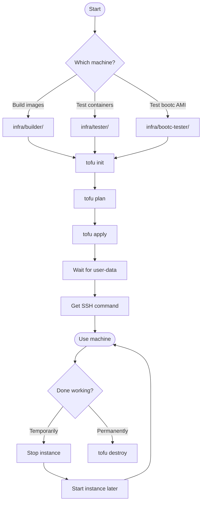

# RUNBOOK-INFRA: Infrastructure Management

**Purpose:** Provision and manage AWS infrastructure for builder, tester, and bootc-tester machines using OpenTofu.

## Prerequisites

- AWS CLI configured with credentials (`aws configure`)
- OpenTofu installed (`brew install opentofu`)
- SSH key pair created in AWS
- `terraform.tfvars` configured in each machine directory

## Overview Diagram



## Machine Reference

| Machine | Directory | Instance Type | Purpose | Hourly Cost |
|---------|-----------|---------------|---------|-------------|
| builder | `infra/builder/` | m6i.xlarge | Build container images | ~$0.19 |
| tester | `infra/tester/` | g4dn.xlarge | Test app containers with GPU | ~$0.53 |
| bootc-tester | `infra/bootc-tester/` | g4dn.xlarge | Boot from custom AMI | ~$0.53 |

## Procedure

### 1. Provision a Machine

```bash
# Navigate to machine directory
cd infra/builder      # OR infra/tester OR infra/bootc-tester

# Initialize OpenTofu (first time only)
tofu init

# Preview changes
tofu plan

# Deploy
tofu apply
```

**Expected output:** Instance ID, public IP, SSH command

### 2. Wait for Setup Completion

The machine runs user-data scripts on first boot. Wait for completion:

```bash
# Get SSH command
tofu output ssh_command

# Create local tmux session for this machine
tmux new -s builder     # Use 'tester' or 'bootc' for other machines

# SSH in (from within tmux) and watch setup progress
ssh -i ~/.ssh/<key>.pem ec2-user@<IP>
sudo tail -f /var/log/user-data.log
```

**Note:** Always work within a local tmux session. If disconnected, reattach with `tmux attach -t builder`.

**Builder ready when:** Log shows "Setup complete"
**Tester ready when:** File exists: `/var/lib/nvidia-setup-complete`

### 3. Get Connection Information

```bash
# Get SSH command
tofu output ssh_command

# Get instance ID (for stop/start)
tofu output instance_id

# Get public IP
tofu output public_ip
```

### 4. Stop Instance (Preserve State, Lower Cost)

Use when taking a break but planning to return:

```bash
# Stop the instance
aws ec2 stop-instances --instance-ids $(tofu output -raw instance_id)

# Verify stopped
aws ec2 describe-instances --instance-ids $(tofu output -raw instance_id) \
  --query 'Reservations[0].Instances[0].State.Name' --output text
```

**Cost while stopped:** Only EBS storage (~$0.08/GB/month = ~$16/month for 200GB)

### 5. Resume Stopped Instance

```bash
# Start the instance
aws ec2 start-instances --instance-ids $(tofu output -raw instance_id)

# Wait for running state
aws ec2 wait instance-running --instance-ids $(tofu output -raw instance_id)

# Get new public IP (changes after stop/start)
tofu refresh
tofu output ssh_command
```

### 6. Destroy Infrastructure

Use when completely done (all data will be lost):

```bash
cd infra/<machine>
tofu destroy
```

**Confirmation required:** Type `yes` when prompted

## Decision Points

### Which Machine to Provision?

| Task | Machine |
|------|---------|
| Build container images | builder |
| Test containers with GPU on standard RHEL | tester |
| Test bootc AMI with services at boot | bootc-tester |

### Stop vs Destroy?

| Scenario | Action | Reason |
|----------|--------|--------|
| Done for the day, returning tomorrow | Stop | Preserves EBS, quick resume |
| Done for a week or more | Destroy | Avoid EBS costs |
| Iterating actively | Keep running | Fastest workflow |

## Verification

### Builder is Ready

```bash
# From within your local tmux session
tmux attach -t builder    # If not already attached
ssh -i ~/.ssh/<key>.pem ec2-user@<IP>

# On builder
podman --version          # Should show podman version
buildah --version         # Should show buildah version
cat /etc/yum.repos.d/nvidia-container-toolkit.repo  # Should exist
```

### Tester is Ready

```bash
# From within your local tmux session
tmux attach -t tester     # If not already attached
ssh -i ~/.ssh/<key>.pem ec2-user@<IP>

# On tester
nvidia-smi               # Should show T4 GPU
podman --version         # Should show podman version
ls /etc/cdi/nvidia.yaml  # Should exist
```

### Bootc-tester is Ready

```bash
# From within your local tmux session
tmux attach -t bootc      # If not already attached
ssh -i ~/.ssh/<key>.pem ec2-user@<IP>

# On bootc-tester - verify services started
systemctl status rhoim-vllm.service
podman ps
```

## Troubleshooting

### SSH Connection Refused

Your IP may have changed. Update `ssh_cidr_blocks` in `terraform.tfvars`:

```bash
# Get current IP
curl https://checkip.amazonaws.com

# Update terraform.tfvars and apply
tofu apply
```

### Instance Stuck in Pending

```bash
# Check instance status
aws ec2 describe-instance-status --instance-ids $(tofu output -raw instance_id)
```

### User-Data Script Failed

```bash
ssh -i ~/.ssh/<key>.pem ec2-user@<IP>
sudo cat /var/log/user-data.log
```

### GPU Not Available (Tester)

```bash
# Check NVIDIA driver loaded
lsmod | grep nvidia

# Check post-boot service
sudo systemctl status nvidia-post-boot-setup.service
sudo journalctl -u nvidia-post-boot-setup.service

# May need reboot if driver just installed
sudo reboot
```
