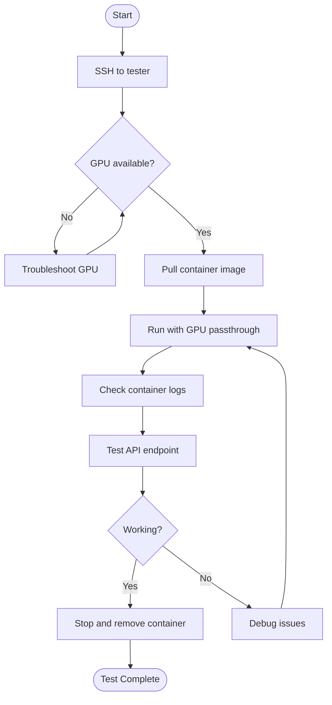
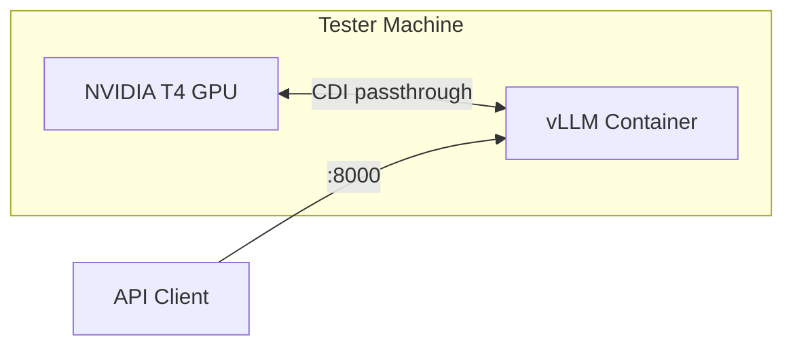

# RUNBOOK-TEST-APP: Test Application Containers

**Purpose:** Test application containers (e.g., RHAIIS vLLM) on the tester machine with GPU passthrough on a standard RHEL host.

## Prerequisites

- Tester machine running (see [RUNBOOK-INFRA](RUNBOOK-INFRA.md))
- GPU drivers verified working
- Container registry credentials configured (if using private images)

## Overview Diagram



## Procedure

### 1. Start Local tmux Session and SSH to Tester

**Always use a local tmux session when working on remote machines.** This protects against network disconnects and allows resuming work.

```bash
# Create or attach to local tmux session for tester
tmux new -s tester || tmux attach -t tester

# Get SSH command
cd infra/tester
tofu output ssh_command

# Connect (from within tmux)
ssh -i ~/.ssh/<key>.pem ec2-user@<TESTER_IP>
```

**If disconnected:** Reattach locally with `tmux attach -t tester`.

### 2. Verify GPU is Available

```bash
nvidia-smi
```

**Expected output:**
```
+-----------------------------------------------------------------------------+
| NVIDIA-SMI 570.xxx       Driver Version: 570.xxx       CUDA Version: 12.x  |
|-------------------------------+----------------------+----------------------+
| GPU  Name        Persistence-M| Bus-Id        Disp.A | Volatile Uncorr. ECC |
| Fan  Temp  Perf  Pwr:Usage/Cap|         Memory-Usage | GPU-Util  Compute M. |
|===============================+======================+======================|
|   0  Tesla T4            Off  | 00000000:00:1E.0 Off |                    0 |
| N/A   30C    P8     9W /  70W |      0MiB / 15360MiB |      0%      Default |
+-------------------------------+----------------------+----------------------+
```

If GPU not available, see Troubleshooting section.

### 3. Pull Application Container

```bash
# RHAIIS vLLM CUDA image
sudo podman pull registry.redhat.io/rhaiis/vllm-cuda-rhel9:latest
```

### 4. Run Container with GPU Passthrough



```bash
sudo podman run -d --name vllm-test \
  --device nvidia.com/gpu=all \
  -p 8000:8000 \
  registry.redhat.io/rhaiis/vllm-cuda-rhel9:latest \
  --model TinyLlama/TinyLlama-1.1B-Chat-v1.0
```

**Options explained:**
- `-d` Run in background (detached)
- `--name vllm-test` Container name for easy reference
- `--device nvidia.com/gpu=all` Pass all GPUs via CDI
- `-p 8000:8000` Expose vLLM API port
- `--model` Specify model to load

### 5. Monitor Container Startup

```bash
# Follow logs
sudo podman logs -f vllm-test
```

**Wait for:** `Uvicorn running on http://0.0.0.0:8000`

This may take several minutes while the model downloads and loads.

### 6. Test API Endpoint

#### List Models

```bash
curl http://localhost:8000/v1/models
```

**Expected:** JSON response listing the loaded model

#### Test Completion

```bash
curl http://localhost:8000/v1/completions \
  -H "Content-Type: application/json" \
  -d '{
    "model": "TinyLlama/TinyLlama-1.1B-Chat-v1.0",
    "prompt": "Hello, how are you?",
    "max_tokens": 50
  }'
```

**Expected:** JSON response with generated text

### 7. Cleanup

```bash
# Stop container
sudo podman stop vllm-test

# Remove container
sudo podman rm vllm-test

# Optional: Remove image to free space
sudo podman rmi registry.redhat.io/rhaiis/vllm-cuda-rhel9:latest
```

## Quick Reference

| Action | Command |
|--------|---------|
| Check GPU | `nvidia-smi` |
| Run vLLM | `sudo podman run -d --name vllm-test --device nvidia.com/gpu=all -p 8000:8000 registry.redhat.io/rhaiis/vllm-cuda-rhel9:latest --model <model>` |
| View logs | `sudo podman logs -f vllm-test` |
| Test API | `curl http://localhost:8000/v1/models` |
| Stop | `sudo podman stop vllm-test && sudo podman rm vllm-test` |

## Common Test Images

| Image | Registry | Purpose |
|-------|----------|---------|
| vllm-cuda-rhel9 | registry.redhat.io/rhaiis/ | RHAIIS vLLM production image |
| cuda:12.3.0-base-ubi9 | docker.io/nvidia/ | Basic CUDA test image |

## Decision Points

### Which Model to Test?

| Model | Size | Use Case |
|-------|------|----------|
| TinyLlama/TinyLlama-1.1B-Chat-v1.0 | ~2GB | Quick tests, fits in T4 easily |
| mistralai/Mistral-7B-v0.1 | ~14GB | Larger model, near T4 limit |

### Rootful vs Rootless Podman?

| Mode | Command | When to Use |
|------|---------|-------------|
| Rootful | `sudo podman ...` | GPU passthrough (required for CDI) |
| Rootless | `podman ...` | CPU-only containers |

**Note:** GPU passthrough requires rootful podman due to device permissions.

## Verification

Test is successful when:

1. `nvidia-smi` shows GPU available
2. Container starts without errors
3. API endpoint responds to requests
4. Model generates completions

## Troubleshooting

### GPU Not Available

```bash
# Check NVIDIA driver loaded
lsmod | grep nvidia

# Check CDI config exists
ls -la /etc/cdi/nvidia.yaml

# Regenerate CDI config
sudo nvidia-ctk cdi generate --output=/etc/cdi/nvidia.yaml

# Check device permissions
ls -la /dev/nvidia*
```

### Container Fails to Start

```bash
# Check detailed logs
sudo podman logs vllm-test

# Check container status
sudo podman ps -a

# Try running interactively for debugging
sudo podman run -it --rm \
  --device nvidia.com/gpu=all \
  registry.redhat.io/rhaiis/vllm-cuda-rhel9:latest \
  nvidia-smi
```

### Out of GPU Memory

```bash
# Check GPU memory usage
nvidia-smi

# Use smaller model
--model TinyLlama/TinyLlama-1.1B-Chat-v1.0

# Or reduce context length
--max-model-len 2048
```

### API Not Responding

```bash
# Check if container is running
sudo podman ps

# Check if port is listening
ss -tlnp | grep 8000

# Check firewall
sudo firewall-cmd --list-all
```

### Registry Authentication Failed

```bash
# Login to Red Hat registry
sudo podman login registry.redhat.io

# Verify credentials
cat /run/user/0/containers/auth.json
```
