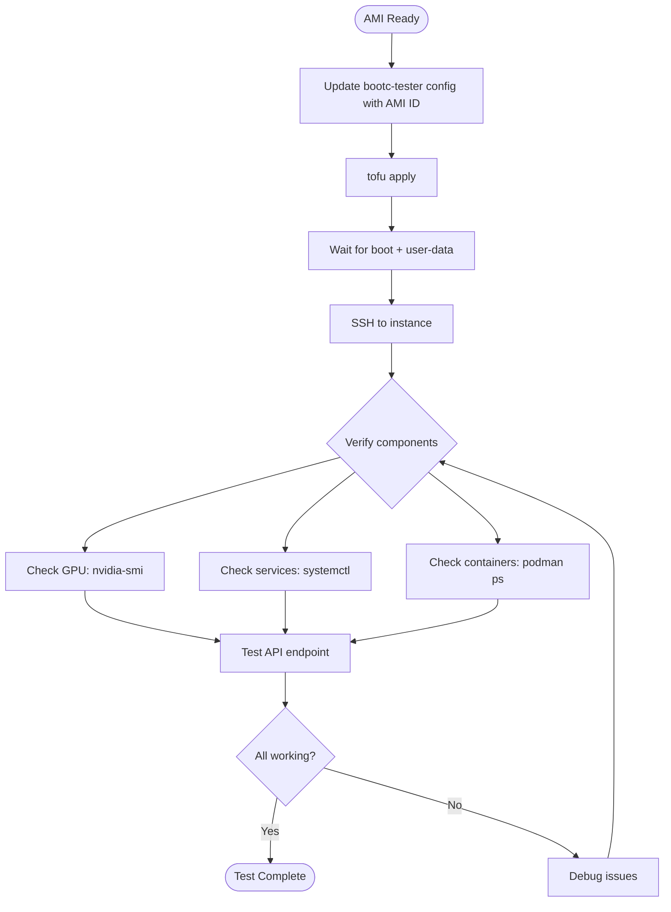
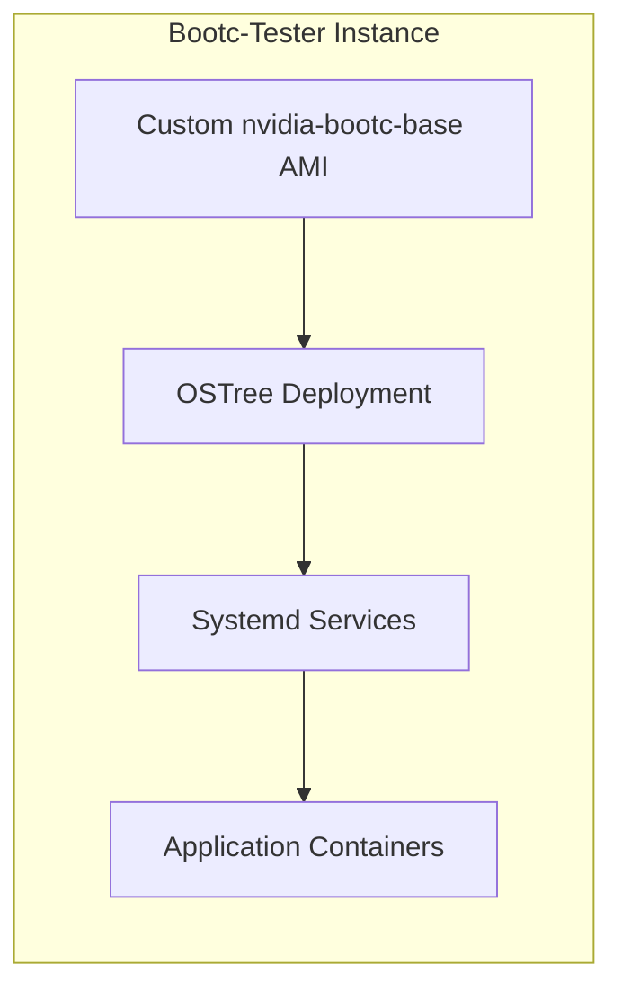

# RUNBOOK-TEST-BOOTC: Test Bootc AMI

**Purpose:** Launch bootc-tester from a custom AMI and verify application containers start automatically at boot.

## Prerequisites

- Custom AMI created (see [RUNBOOK-CREATE-AMI](RUNBOOK-CREATE-AMI.md))
- AMI ID noted
- Hugging Face token stored in AWS Secrets Manager (optional, for gated models)

## Overview Diagram



## Procedure

### 1. Update bootc-tester Configuration

Edit `infra/bootc-tester/terraform.tfvars` to use the new AMI:

```hcl
# infra/bootc-tester/terraform.tfvars
ami_id = "ami-0xxxxxxxxxxxx"  # Your new AMI ID from RUNBOOK-CREATE-AMI
```

### 2. Apply Infrastructure Changes

```bash
cd infra/bootc-tester

# Initialize (first time only)
tofu init

# Preview changes
tofu plan

# Apply
tofu apply
```

**Expected:** New instance created from your custom AMI

### 3. Wait for Boot and Setup

The bootc image boots with:
1. Pre-installed NVIDIA drivers (from your image)
2. User-data script that:
   - Registers with RHSM
   - Fetches HF token from Secrets Manager
   - Generates CDI config for GPU
   - Enables podman socket

**Start a local tmux session before connecting:**

```bash
# Create or attach to local tmux session for bootc-tester
tmux new -s bootc || tmux attach -t bootc

# Get SSH command
tofu output ssh_command

# SSH to instance (from within tmux)
ssh -i ~/.ssh/<key>.pem ec2-user@<IP>

# Watch user-data progress
sudo tail -f /var/log/user-data.log
```

**If disconnected:** Reattach locally with `tmux attach -t bootc`.

**Wait for:** `RHOIM bootc-tester setup complete`

### 4. Verify GPU is Available

```bash
nvidia-smi
```

**Expected:** Tesla T4 GPU visible with driver loaded

### 5. Verify Bootc Status

```bash
bootc status
```

**Expected:** Shows your image as the running deployment



### 6. Verify Systemd Services

Check services defined in your bootc image:

```bash
# Check vLLM service (if configured in image)
systemctl status rhoim-vllm.service

# Check HF token fetch service (if configured)
systemctl status fetch-hf-token.service

# View service logs
journalctl -u rhoim-vllm.service -f
```

### 7. Check Running Containers

```bash
# List running containers
sudo podman ps

# List all containers (including stopped)
sudo podman ps -a
```

### 8. Test API Endpoint

If vLLM is running:

```bash
# Test from inside the instance
curl http://localhost:8000/v1/models

# Test from outside (if port 8000 is open)
curl http://<PUBLIC_IP>:8000/v1/models
```

### 9. Verify HF Token (Optional)

If your image uses Hugging Face models:

```bash
# Check if token was fetched
cat /etc/vllm/hf-token.env

# Token should be available to services
echo $HF_TOKEN
```

## Quick Reference

| Check | Command |
|-------|---------|
| GPU status | `nvidia-smi` |
| Bootc status | `bootc status` |
| Service status | `systemctl status rhoim-vllm.service` |
| Running containers | `sudo podman ps` |
| Service logs | `journalctl -u rhoim-vllm.service -f` |
| API test | `curl http://localhost:8000/v1/models` |

## What to Verify

| Component | Check | Expected |
|-----------|-------|----------|
| GPU | `nvidia-smi` | T4 GPU visible |
| CDI | `ls /etc/cdi/nvidia.yaml` | File exists |
| Bootc | `bootc status` | Shows your image |
| Services | `systemctl status <service>` | Active (running) |
| Containers | `sudo podman ps` | Container(s) running |
| API | `curl localhost:8000/v1/models` | JSON response |

## Decision Points

### Service Not Starting Automatically?

Check if the service is enabled:
```bash
systemctl is-enabled rhoim-vllm.service
```

If not, it may need to be enabled in the Containerfile:
```dockerfile
RUN systemctl enable rhoim-vllm.service
```

### Need to Update the Image?

Two options:

| Method | Use When |
|--------|----------|
| Rebuild AMI | Major changes, clean state needed |
| `bootc switch` | Quick iteration, testing container changes |

For quick iteration:
```bash
# Pull updated image and switch
sudo bootc switch <registry>/<image>:<tag>
sudo reboot
```

## Verification

Test is successful when:

1. Instance boots from custom AMI
2. `nvidia-smi` shows GPU
3. `bootc status` shows your image deployment
4. Systemd services are running
5. Containers are running (if configured)
6. API responds (if applicable)

## Troubleshooting

### GPU Not Available

```bash
# Check driver module
lsmod | grep nvidia

# Check for errors
dmesg | grep -i nvidia

# May need CDI regeneration
sudo nvidia-ctk cdi generate --output=/etc/cdi/nvidia.yaml
```

### Service Failed to Start

```bash
# Check service status
systemctl status rhoim-vllm.service

# View detailed logs
journalctl -u rhoim-vllm.service --no-pager

# Check if container can start manually
sudo podman run --rm -it --device nvidia.com/gpu=all <image> nvidia-smi
```

### User-Data Script Failed

```bash
# Check user-data log
sudo cat /var/log/user-data.log

# Check cloud-init status
cloud-init status

# View cloud-init logs
sudo cat /var/log/cloud-init-output.log
```

### HF Token Not Available

```bash
# Check if secret exists
aws secretsmanager get-secret-value --secret-id rhoim-hf-token --region us-east-1

# Check instance role
curl http://169.254.169.254/latest/meta-data/iam/security-credentials/

# Manually fetch token
aws secretsmanager get-secret-value --secret-id rhoim-hf-token --query SecretString --output text
```

### SSH Connection Refused

Your IP may have changed:
```bash
# Get current IP
curl https://checkip.amazonaws.com

# Update terraform.tfvars and apply
cd infra/bootc-tester
# Edit ssh_cidr_blocks
tofu apply
```

## Cleanup

```bash
# Destroy bootc-tester instance
cd infra/bootc-tester
tofu destroy
```

**Note:** The AMI remains available for future testing.
