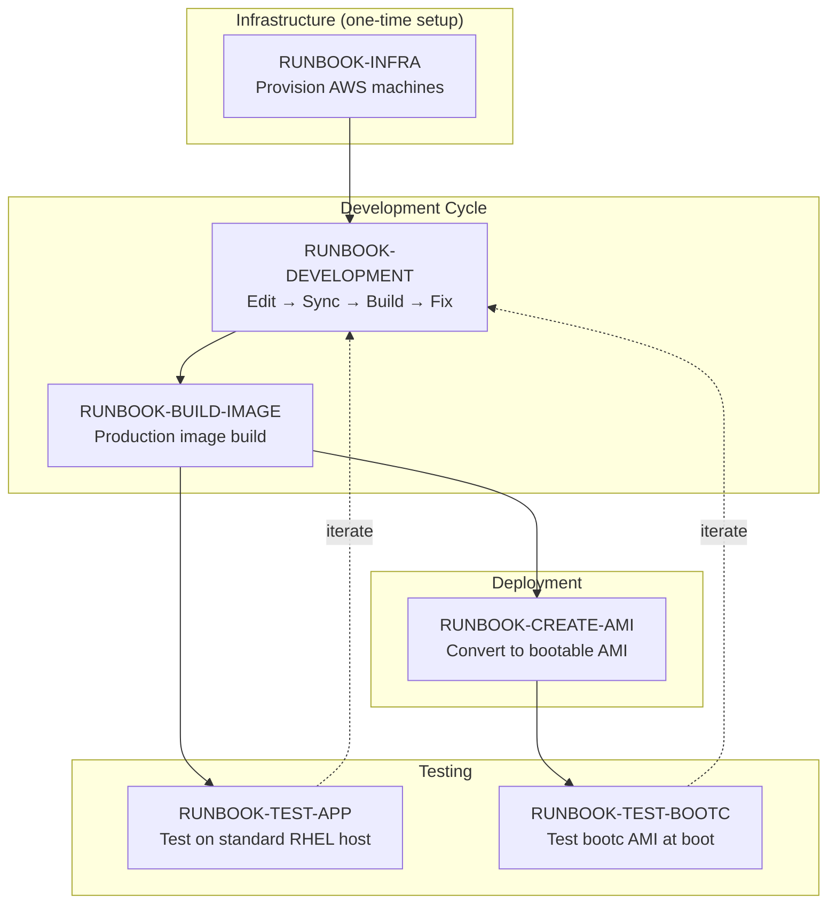

# RHOIM Bootc Images - Workflow Runbooks

This directory contains runbooks for all development, build, and deploy workflows. Each runbook provides step-by-step procedures with exact commands for consistent, reproducible execution.

## Master Workflow Overview



## Runbook Quick Reference

| Runbook | Purpose | When to Use |
|---------|---------|-------------|
| [RUNBOOK-INFRA](RUNBOOK-INFRA.md) | Provision/manage AWS machines | Starting fresh, need infrastructure |
| [RUNBOOK-DEVELOPMENT](RUNBOOK-DEVELOPMENT.md) | Edit → rsync → build loop | Iterating on container changes |
| [RUNBOOK-BUILD-IMAGE](RUNBOOK-BUILD-IMAGE.md) | Full production build | Ready for final image build |
| [RUNBOOK-CREATE-AMI](RUNBOOK-CREATE-AMI.md) | Convert image to AMI | Need bootable AWS AMI |
| [RUNBOOK-TEST-APP](RUNBOOK-TEST-APP.md) | Test containers with GPU | Validate app containers work |
| [RUNBOOK-TEST-BOOTC](RUNBOOK-TEST-BOOTC.md) | Test bootc AMI deployment | Validate full production stack |

## Common Scenarios

### Starting Fresh
```
RUNBOOK-INFRA → RUNBOOK-DEVELOPMENT
```
Provision builder machine, then start development iteration.

### Testing a Change
```
RUNBOOK-DEVELOPMENT → RUNBOOK-BUILD-IMAGE → RUNBOOK-TEST-APP
```
Iterate on changes, build image, test with GPU on tester.

### Creating a New AMI
```
RUNBOOK-BUILD-IMAGE → RUNBOOK-CREATE-AMI → RUNBOOK-TEST-BOOTC
```
Build final image, convert to AMI, test boot sequence.

### Full End-to-End
```
RUNBOOK-INFRA → RUNBOOK-DEVELOPMENT → RUNBOOK-BUILD-IMAGE → RUNBOOK-CREATE-AMI → RUNBOOK-TEST-BOOTC
```
Complete workflow from infrastructure to production AMI.

## Machine Reference

| Machine | Instance Type | Purpose | Hourly Cost |
|---------|--------------|---------|-------------|
| builder | m6i.xlarge | Build container images | ~$0.19 |
| tester | g4dn.xlarge | Test app containers with GPU | ~$0.53 |
| bootc-tester | g4dn.xlarge | Boot from custom AMI | ~$0.53 |

## Conventions

- **rsync flags:** `rsync -avz` (archive, verbose, compressed)
- **Build commands:** `podman build` directly
- **Builder target directory:** `~/development/`

### Local tmux Sessions for Remote Work

**Always use a local tmux session when working on remote machines.** This protects against network disconnects and allows resuming work.

```bash
# Pattern: Create local tmux session named after the machine
tmux new -s builder     # For builder machine
tmux new -s tester      # For tester machine
tmux new -s bootc       # For bootc-tester machine

# SSH to the machine from within the tmux session
ssh -i ~/.ssh/<key>.pem ec2-user@<IP>

# If disconnected, reattach locally
tmux attach -t builder
```

| Machine | tmux Session Name | Purpose |
|---------|-------------------|---------|
| builder | `builder` | Build container images |
| tester | `tester` | Test containers with GPU |
| bootc-tester | `bootc` | Test bootc AMI at boot |
